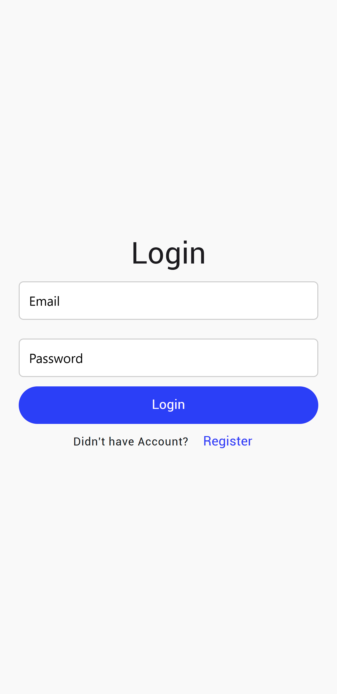
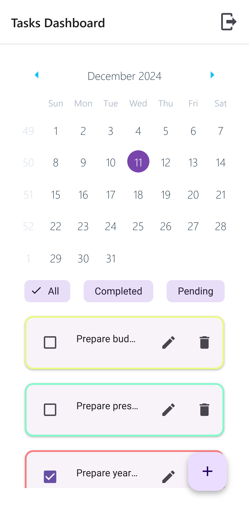
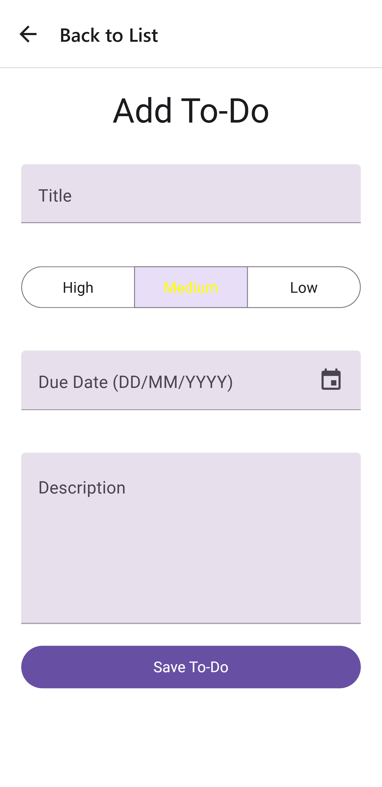
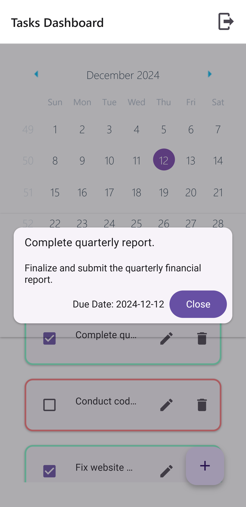

# To-Do App


This is a full-stack To-Do application that enables users to manage their tasks effectively. The app is built using **React Native Expo** for the front end, **Node.js** and **Express.js** for the back end, and **MySQL** for the database. It leverages **React Native Paper** for UI components, providing a sleek and modern design.

<table>
  <tr>
    <td></td>
    <td></td>
  </tr>
  <tr>
    <td></td>
    <td></td>
  </tr>
</table>

## Features

- Add, edit, and delete tasks.
- Mark tasks as completed or pending.
- Filter tasks by status (Completed or Pending) and Date.
- Persistent storage with a MySQL database.

## Technology Stack

### Front End

- **React Native Expo**: Framework for building and testing mobile applications.
- **React Native Paper**: Library for building UI components.

### Back End

- **Node.js**: JavaScript runtime environment.
- **Express.js**: Web framework for Node.js.

### Database

- **MySQL**: Relational database for storing tasks and user information.

## Installation and Setup

### Prerequisites

Ensure you have the following installed on your machine:

- [Node.js](https://nodejs.org/)
- [MySQL](https://dev.mysql.com/downloads/)
- A package manager like `npm` or `yarn`

### Backend Setup

1. Clone the repository:

   ```bash
   git clone <repository-url>
   cd backend
   ```

2. Install dependencies:

   ```bash
   npm install
   ```

3. Create a `.env` file and configure the database connection:

   ```env
   DB_HOST=localhost
   DB_USER=root
   DB_PASSWORD=<<yourpassword>>
   DB_NAME=todo_db
   JWT_SECRET=secret_key
   JWT_EXPIRATION=24h
   PORT=3000
   ```

4. Initialize the database:

   ```sql
   CREATE DATABASE todo_db;
   ```

   Create a Database Named `todo_db` Run the provided SQL script to create necessary tables.

5. Start the server:
   ```bash
   npm start
   ```
   The server will run on `http://localhost:3000`.

### Frontend Setup

1. Navigate to the front-end directory:

   ```bash
   cd ../frontend
   ```

2. Install dependencies:

   ```bash
   npm install
   ```

3. Configure API endpoints:
   
   Create a `.env` file and configure the  API endpoint:

   ```env
   API_URL=http://localhost:3000/api
   ```

4. Run the application:
   Start Expo development server:
   ```bash
   npx expo start
   ```
use this email and password to login user already created

{"email": "saman@gmail.com","password": "1234"}

### Project Directory Structure

```
ToDO
├── backend
│   ├──src
|   |  |─ config
|   |  |─ controllers
│   |  |─ models
│   |  └─ routes
│   ├── server.js
│   ├── .env
│   └── package.json
├── frontend
│   ├── src
│   │   ├── assets
│   │   ├── components
│   │   └── screens
|   |── .env
|   |── App.js
│   └── package.json
└── README.md
```


